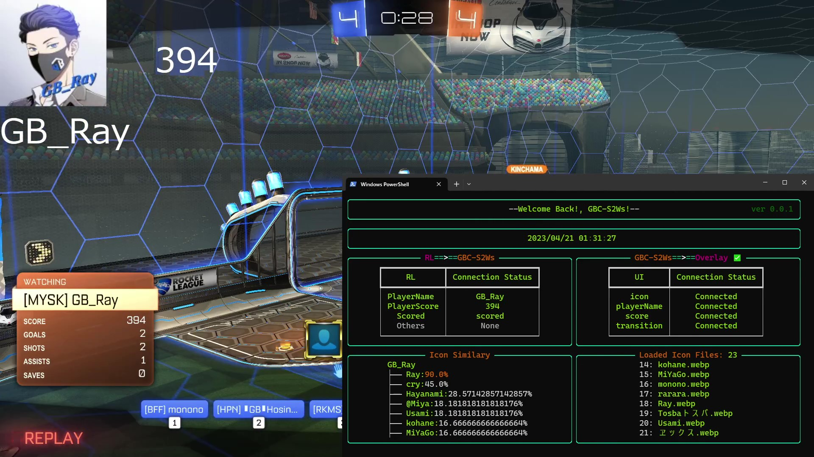

# GBC-S2Ws(仮)
- GBC用オーバーレイ追加ソフトウェア（アイコン・名前・スコア・トランジション）

# DEMO

# Features
- 前提の**bakkesmod Plugin**を導入することで簡単に利用することができます．
- オーバーレイはOBSにて**Local Browser**として簡単に読み込むことができます．
- Icon画像のファイル名は，RLのユーザー名に最も類似度が高いファイルを自動的に選択するため，**完全一致で画像ファイルをRenameする必要がありません**
- ユーザー用の**CUI**を完備
- Websocket，Socket通信で実装しているため，**リアルタイム性が高い**です．

# Requirement
- Bakkesmod Plugin "Pras"

# Installation
- [Prasダウンロードリンク](https://github.com/Kazuryu0907/PraS/releases/tag/Pras4GBC-S2Wsv1.1)
- bakkesmod Pluginの導入に関しては[ここ](https://note.com/forusian/n/n0d15fde904d3)を参照ください．

# Usage
1\. `graphics/images`に参加者の立ち絵ファイルを設置します．このとき，ファイル名はRLのユーザー名と**完全一致する必要はありません**が，類似度推定が間違えない程度に近い名前に設定します．任意の拡張子に対応しています．  

2\. GBC-S2Wsを起動します．   

3\.  RLにてPrasをロードします．(F6押下から`Plugin Load Pras`)  

4\. CUIにて，**RL=>GBC-S2Ws**欄の**Others**が`init`に変化すれば接続良好です．(UDP通信のため，コネクションを確立する必要はありません)  

5\. `graphics`フォルダにある`icon.html`,`playerName.html`,`score.html`,`transition.html`をOBSのブラウザソースから**ローカルファイル**にチェックを入れ，読み込みます．(**シーンがアクティブになったときにブラウザの表示を更新する**にチェックを入れておくのをおすすめします)  

6\. 各ブラウザソースを読み込み，CUI右側の**GBC-S2Ws=>=Overlay**の`Connection Status`が**None**から**Connected**に変化すれば接続完了です．(TCP通信のため，こちらはコネクション確立が必要です)  

7\. すべての`Connection Status`が**Connected**になれば，準備完了です．観戦画面にいき，動作を確認しましょう！

# Note
- 立ち絵ファイルが1枚も存在していないと落ちます
- CUIの説明
  - `RL=>=GBC-S2Ws`はRLから送られてきたデータを表示しています
  - `GBC-S2Ws=>=Overlay`は本ソフトウェアからブラウザへの接続状況を表しています
  - `Icon Similary`はプレイヤー名から最も類似度が高いIcon画像ファイルをTree状に表示しています
  - `Loaded Icon Files: N`は読み込んだIcon画像ファイルを表示しています．`N`は読み込んだファイル数です 

# Author
* 作成者:[kazuryu](https://twitter.com/kazuryu_RL)
* 所属：なし

# License
Copyright (c) 2023 Kazuryu
